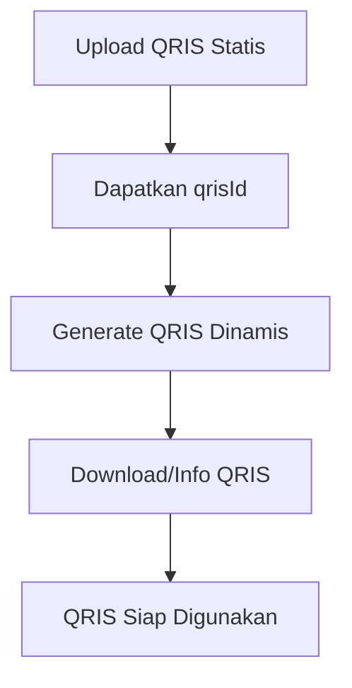

# QRIS Dinamis REST API

🚀 **API REST untuk menggenerate QRIS dinamis dengan nominal yang dapat disesuaikan**

Sistem ini memungkinkan upload gambar QRIS statis dan mengkonversinya menjadi QRIS dinamis dengan nominal yang ditambahkan digit acak untuk keamanan transaksi.

## 🌟 Fitur Utama

- 📤 **Upload QRIS Statis**: Upload gambar QRIS untuk diproses
- ⚡ **Generate QRIS Dinamis**: Buat QRIS dengan nominal yang disesuaikan
- 🎲 **Digit Acak**: Otomatis menambahkan 3 digit acak di belakang nominal
- 🔐 **Session Management**: Sistem berbasis UUID untuk tracking QRIS
- 🧹 **Auto Cleanup**: File otomatis terhapus setelah 30 menit
- 🛡️ **Error Handling**: Penanganan error yang komprehensif
- 🌐 **CORS Support**: Mendukung cross-origin requests
- 📱 **Test Interface**: Interface web untuk testing API

## 📋 Persyaratan Sistem

- Node.js 18+ 
- NPM atau Yarn
- Git

## 🚀 Quick Start

### 1. Clone Repository
```bash
git clone https://github.com/Pendetot/Qris-Dinamis.git
cd Qris-Dinamis
git checkout feature/rest-api-conversion
```

### 2. Install Dependencies
```bash
npm install
```

### 3. Jalankan Server
```bash
npm start
```

Server akan berjalan di `http://localhost:3000`

### 4. Test API
Buka browser dan akses `http://localhost:3000/test.html` untuk interface testing.

## 📚 API Documentation

### Base URL
- **Local**: `http://localhost:3000`
- **Public**: `http://f6576fecb07597a310.blackbx.ai`

### Health Check
```http
GET /api/health
```

**Response:**
```json
{
  "status": "OK",
  "message": "QRIS Dynamic API is running",
  "timestamp": "2025-06-14T14:32:11.276Z"
}
```

### Upload QRIS Statis
```http
POST /api/qris/upload
Content-Type: multipart/form-data
```

**Body:**
- `qris`: File gambar QRIS (JPG, PNG, GIF, BMP - Max 5MB)

**Response Success:**
```json
{
  "success": true,
  "data": {
    "qrisId": "550e8400-e29b-41d4-a716-446655440000",
    "message": "QRIS berhasil dibaca dan siap untuk generate dinamis"
  }
}
```

**Response Error:**
```json
{
  "success": false,
  "message": "Only image files are allowed"
}
```

### Generate QRIS Dinamis
```http
POST /api/qris/generate
Content-Type: application/json
```

**Body:**
```json
{
  "qrisId": "550e8400-e29b-41d4-a716-446655440000",
  "nominal": 10000
}
```

**Response Success:**
```json
{
  "success": true,
  "data": {
    "qrisId": "550e8400-e29b-41d4-a716-446655440000",
    "nominal": 10000123,
    "expirationTime": 1718374914482,
    "message": "QRIS Dinamis berhasil dibuat dengan nominal Rp 10.000.123"
  }
}
```

### Download QRIS
```http
GET /api/qris/:id
```
Download file QRIS yang sudah di-generate sebagai file PNG.

### Info QRIS
```http
GET /api/qris/:id/info
```

**Response:**
```json
{
  "success": true,
  "data": {
    "qrisId": "550e8400-e29b-41d4-a716-446655440000",
    "nominal": 10000123,
    "expirationTime": 1718374914482,
    "generatedAt": 1718374614482,
    "isExpired": false
  }
}
```

### Generate QRIS sebagai Buffer
```http
POST /api/qris/generate-buffer
Content-Type: application/json
```

**Body:**
```json
{
  "qrisId": "550e8400-e29b-41d4-a716-446655440000",
  "nominal": 10000
}
```

**Response:** File gambar PNG langsung sebagai buffer

## 🎯 Workflow Penggunaan



1. **Upload QRIS Statis** → Kirim gambar QRIS ke `/api/qris/upload`
2. **Simpan qrisId** → Simpan UUID yang dikembalikan dari response
3. **Generate QRIS Dinamis** → Kirim qrisId + nominal ke `/api/qris/generate`
4. **Download QRIS** → Akses `/api/qris/:id` atau `/api/qris/:id/info`

## 🧪 Testing

### Interface Web
Buka `http://localhost:3000/test.html` untuk interface testing interaktif.

### Command Line Testing
```bash
# Health check
curl http://localhost:3000/api/health

# Upload QRIS (ganti dengan path file yang sesuai)
curl -X POST -F "qris=@qris-sample.jpg" http://localhost:3000/api/qris/upload

# Generate QRIS dinamis
curl -X POST -H "Content-Type: application/json"   -d '{"qrisId":"your-qris-id","nominal":50000}'   http://localhost:3000/api/qris/generate

# Download QRIS
curl -O http://localhost:3000/api/qris/your-qris-id

# Info QRIS
curl http://localhost:3000/api/qris/your-qris-id/info
```

## 📁 Struktur Project

```
qris-dinamis/
├── 📄 server.js              # Server utama Express.js
├── 📄 package.json           # Dependencies dan scripts
├── 📄 qrDinamis.js           # Logic QRIS original
├── 📄 test.html              # Interface testing
├── 📄 README.md              # Dokumentasi (file ini)
├── 📁 routes/
│   └── 📄 qris.js            # Route handlers API
├── 📁 services/
│   ├── 📄 qrisService.js     # Business logic QRIS
│   └── 📄 qrReaderService.js # Service baca QR code
├── 📁 middleware/
│   ├── 📄 upload.js          # Handling upload file
│   └── 📄 errorHandler.js    # Error handling
└── 📁 uploads/               # Temporary file storage
    └── 📄 .gitkeep           # Keep directory in git
```

## ⚙️ Konfigurasi

### Environment Variables
Buat file `.env` untuk konfigurasi:

```env
PORT=3000
NODE_ENV=production
UPLOAD_DIR=uploads
MAX_FILE_SIZE=5242880
SESSION_TIMEOUT=1800000
```

### File Upload Settings
- **Maksimal ukuran**: 5MB
- **Format yang didukung**: JPG, PNG, GIF, BMP
- **Lokasi upload**: `uploads/` directory
- **Auto cleanup**: 30 menit

## 🔒 Keamanan

- ✅ Validasi file upload (hanya gambar)
- ✅ Pembatasan ukuran file (5MB)
- ✅ Auto cleanup file temporary
- ✅ Error handling yang aman
- ✅ CORS protection
- ✅ Input validation
- ✅ UUID-based session management

## 🚀 Deployment

### Development
```bash
npm run dev
```

### Production
```bash
npm start
```

### Docker Deployment
```dockerfile
FROM node:18-alpine
WORKDIR /app
COPY package*.json ./
RUN npm ci --only=production
COPY . .
EXPOSE 3000
CMD ["npm", "start"]
```

```bash
# Build dan run Docker
docker build -t qris-dinamis-api .
docker run -p 3000:3000 qris-dinamis-api
```

### PM2 Deployment
```bash
# Install PM2
npm install -g pm2

# Start dengan PM2
pm2 start server.js --name "qris-api"

# Monitor
pm2 monit

# Logs
pm2 logs qris-api
```

## 🤝 Kontribusi

1. Fork repository
2. Buat feature branch (`git checkout -b feature/amazing-feature`)
3. Commit perubahan (`git commit -m 'Add amazing feature'`)
4. Push ke branch (`git push origin feature/amazing-feature`)
5. Buat Pull Request

## 📝 Changelog

### v2.0.0 (2025-06-14) - REST API Conversion
- ✅ **BREAKING**: Konversi dari Telegram Bot ke REST API
- ✅ Tambah Express.js server dengan CORS
- ✅ Implementasi file upload dengan multer
- ✅ Session management dengan UUID
- ✅ Auto cleanup expired files (30 menit)
- ✅ Comprehensive error handling
- ✅ Test interface HTML interaktif
- ✅ Dokumentasi API lengkap
- ✅ Modular architecture (routes, services, middleware)

### v1.0.0 - Telegram Bot Version
- ✅ Telegram Bot untuk QRIS dinamis
- ✅ QR code reading dan generation
- ✅ Random digit generation (3 digit)

## 🐛 Troubleshooting

### Error: EADDRINUSE
```bash
# Kill process yang menggunakan port 3000
pkill -f "node server.js"
# atau
lsof -ti:3000 | xargs kill
```

### Error: File upload gagal
- Pastikan file adalah gambar (JPG, PNG, GIF, BMP)
- Pastikan ukuran file < 5MB
- Pastikan direktori `uploads/` ada dan writable

### Error: QRIS tidak terbaca
- Pastikan gambar QRIS jelas dan tidak blur
- Pastikan format QRIS sesuai standar Indonesia
- Coba dengan gambar QRIS yang berbeda

## 📄 Lisensi

Proyek ini dilisensikan di bawah [MIT License](LICENSE).

## 🆘 Support & Help

Jika mengalami masalah atau memiliki pertanyaan:

1. 📖 Baca dokumentasi ini dengan teliti
2. 🔍 Cek [Issues](https://github.com/Pendetot/Qris-Dinamis/issues) yang sudah ada
3. 🆕 Buat issue baru jika diperlukan
4. 📧 Sertakan detail error dan langkah reproduksi

### Template Issue
```markdown
**Deskripsi Bug:**
[Jelaskan bug yang terjadi]

**Langkah Reproduksi:**
1. [Langkah pertama]
2. [Langkah kedua]
3. [dst...]

**Expected Behavior:**
[Apa yang seharusnya terjadi]

**Screenshots:**
[Jika ada, lampirkan screenshot]

**Environment:**
- OS: [e.g. Ubuntu 20.04]
- Node.js: [e.g. 18.17.0]
- Browser: [e.g. Chrome 91]
```

## 🙏 Acknowledgments

- [QRCode](https://www.npmjs.com/package/qrcode) - QR code generation
- [QRCode-Reader](https://www.npmjs.com/package/qrcode-reader) - QR code reading  
- [Jimp](https://www.npmjs.com/package/jimp) - Image processing
- [Express.js](https://expressjs.com/) - Web framework
- [Multer](https://www.npmjs.com/package/multer) - File upload handling
- [UUID](https://www.npmjs.com/package/uuid) - Unique identifier generation

## 🌟 Star History

Jika project ini membantu, jangan lupa beri ⭐ di GitHub!

---

**Dibuat dengan ❤️ untuk kemudahan transaksi QRIS dinamis di Indonesia**

> 💡 **Tips**: Gunakan interface testing di `/test.html` untuk mencoba semua fitur API dengan mudah!
